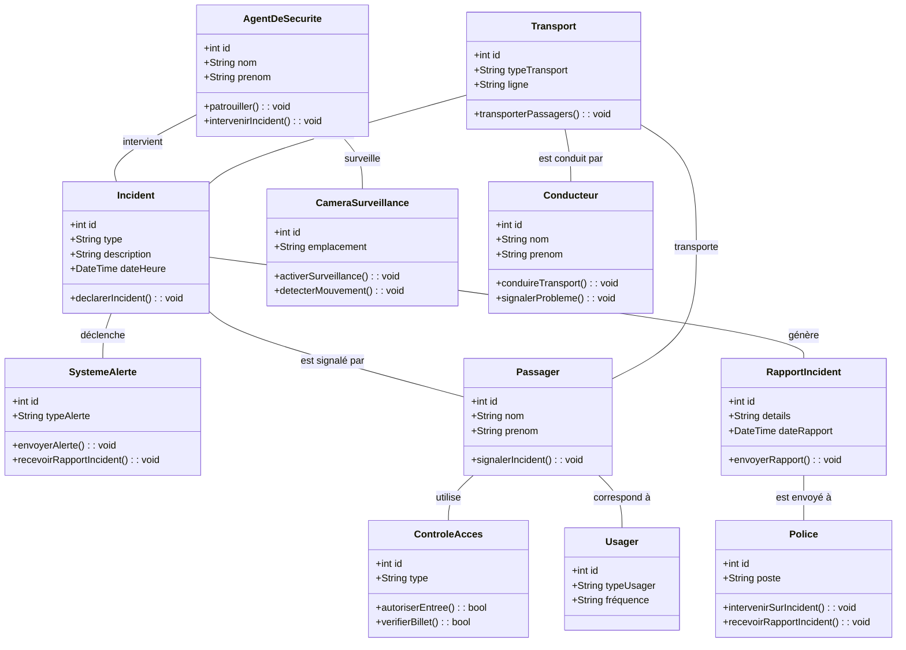

```mermaid
classDiagram
    AgentDeSecurite -- Incident : intervient
    AgentDeSecurite -- CameraSurveillance : surveille
    Incident -- SystemeAlerte : déclenche
    Incident -- Passager : est signalé par
    Passager -- ControleAcces : utilise
    Passager -- Usager : correspond à
    Incident -- RapportIncident : génère
    RapportIncident -- Police : est envoyé à
    Transport -- Conducteur : est conduit par
    Transport -- Passager : transporte
    Transport -- Incident : concerne

    class AgentDeSecurite {
        +int id
        +String nom
        +String prenom
        +patrouiller(): void
        +intervenirIncident(): void
    }

    class CameraSurveillance {
        +int id
        +String emplacement
        +activerSurveillance(): void
        +detecterMouvement(): void
    }

    class ControleAcces {
        +int id
        +String type
        +autoriserEntree(): bool
        +verifierBillet(): bool
    }

    class Incident {
        +int id
        +String type
        +String description
        +DateTime dateHeure
        +declarerIncident(): void
    }

    class SystemeAlerte {
        +int id
        +String typeAlerte
        +envoyerAlerte(): void
        +recevoirRapportIncident(): void
    }

    class Passager {
        +int id
        +String nom
        +String prenom
        +signalerIncident(): void
    }

    class Usager {
        +int id
        +String typeUsager
        +String fréquence
    }

    class RapportIncident {
        +int id
        +String details
        +DateTime dateRapport
        +envoyerRapport(): void
    }

    class Police {
        +int id
        +String poste
        +intervenirSurIncident(): void
        +recevoirRapportIncident(): void
    }

    class Transport {
        +int id
        +String typeTransport
        +String ligne
        +transporterPassagers(): void
    }

    class Conducteur {
        +int id
        +String nom
        +String prenom
        +conduireTransport(): void
        +signalerProbleme(): void
    }
```
