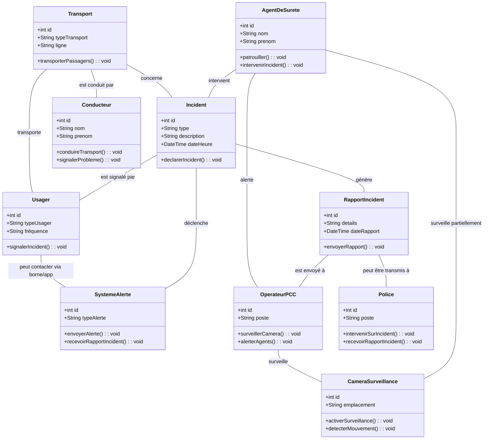

```mermaid
classDiagram
    AgentDeSurete -- Incident : intervient
    AgentDeSurete -- CameraSurveillance : surveille partiellement
    Incident -- SystemeAlerte : déclenche
    Incident -- Usager : est signalé par
    Incident -- RapportIncident : génère
    RapportIncident -- OperateurPCC : est envoyé à
    RapportIncident -- Police : peut être transmis à
    Transport -- Conducteur : est conduit par
    Transport -- Usager : transporte
    Transport -- Incident : concerne
    OperateurPCC -- CameraSurveillance : surveille
    OperateurPCC -- AgentDeSurete : alerte
    Usager -- SystemeAlerte : peut contacter via borne/app

    class AgentDeSurete {
        +int id
        +String nom
        +String prenom
        +patrouiller(): void
        +intervenirIncident(): void
    }

    class CameraSurveillance {
        +int id
        +String emplacement
        +activerSurveillance(): void
        +detecterMouvement(): void
    }

    class Incident {
        +int id
        +String type
        +String description
        +DateTime dateHeure
        +declarerIncident(): void
    }

    class SystemeAlerte {
        +int id
        +String typeAlerte
        +envoyerAlerte(): void
        +recevoirRapportIncident(): void
    }

    class Usager {
        +int id
        +String typeUsager
        +String fréquence
        +signalerIncident(): void
    }

    class RapportIncident {
        +int id
        +String details
        +DateTime dateRapport
        +envoyerRapport(): void
    }

    class OperateurPCC {
        +int id
        +String poste
        +surveillerCamera(): void
        +alerterAgents(): void
    }

    class Police {
        +int id
        +String poste
        +intervenirSurIncident(): void
        +recevoirRapportIncident(): void
    }

    class Transport {
        +int id
        +String typeTransport
        +String ligne
        +transporterPassagers(): void
    }

    class Conducteur {
        +int id
        +String nom
        +String prenom
        +conduireTransport(): void
        +signalerProbleme(): void
    }
```
