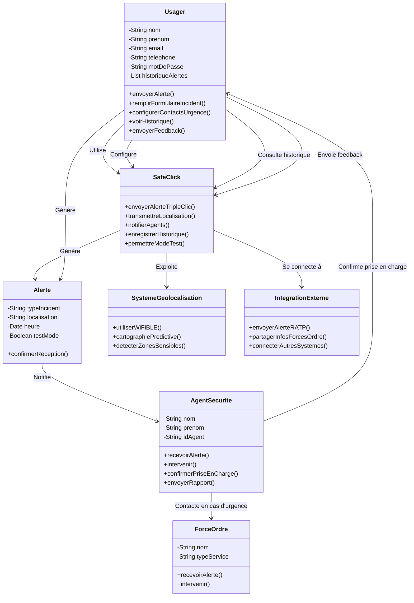

```mermaid
classDiagram
    Usager --> SafeClick : Utilise
    SafeClick --> Alerte : Génère
    SafeClick --> SystemeGeolocalisation : Exploite
    SafeClick --> IntegrationExterne : Se connecte à
    Alerte --> AgentSecurite : Notifie
    AgentSecurite --> ForceOrdre : Contacte en cas d'urgence
    AgentSecurite --> Usager : Confirme prise en charge
    Usager --> Alerte : Génère
    Usager --> SafeClick : Configure
    Usager --> SafeClick : Consulte historique
    Usager --> SafeClick : Envoie feedback
    class Usager {
        -String nom
        -String prenom
        -String email
        -String telephone
        -String motDePasse
        -List historiqueAlertes
        +envoyerAlerte()
        +remplirFormulaireIncident()
        +configurerContactsUrgence()
        +voirHistorique()
        +envoyerFeedback()
    }

    class SafeClick {
        +envoyerAlerteTripleClic()
        +transmettreLocalisation()
        +notifierAgents()
        +enregistrerHistorique()
        +permettreModeTest()
    }

    class Alerte {
        -String typeIncident
        -String localisation
        -Date heure
        -Boolean testMode
        +confirmerReception()
    }

    class AgentSecurite {
        -String nom
        -String prenom
        -String idAgent
        +recevoirAlerte()
        +intervenir()
        +confirmerPriseEnCharge()
        +envoyerRapport()
    }

    class ForceOrdre {
        -String nom
        -String typeService
        +recevoirAlerte()
        +intervenir()
    }

    class SystemeGeolocalisation {
        +utiliserWiFiBLE()
        +cartographiePredictive()
        +detecterZonesSensibles()
    }

    class IntegrationExterne {
        +envoyerAlerteRATP()
        +partagerInfosForcesOrdre()
        +connecterAutresSystemes()
    }

```
